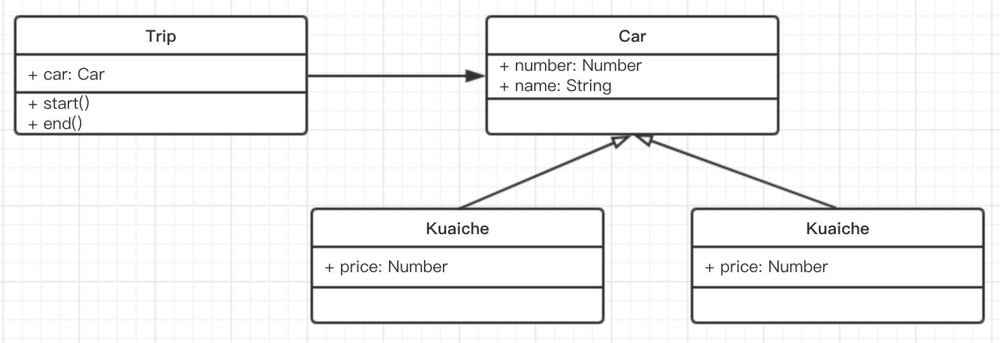
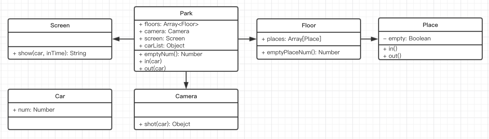

# 1. 面向对象
抽象类和对象

三要素
  + 封装：
    - `public` 开放性访问
    - `protected` 只有继承的子类可访问
    - `private` 只有自身可访问
    这是 java 中最基本的知识，不过在 ES6 中不支持，而在 typescript 是支持的
  + 继承：继承的意义就在于将底层的、公共的属性抽离出来，单独存放，提高复用，极少冗余
  + 多态：多态即执行同样的方法，不同对象会有不同表现。前端用的比较少，因为这个特性一般要结合接口、重载、重写等 java 的特性去使用。

**编程应该 简单 & 抽象**，面向对象是一种目前主流的编程思想，也是学习设计模式的前提，因为设计模式就是基于面向对象思想的。

**早期的人们之所以没有实现计算机，不是因为他们想的不够复杂，而是因为想的不够简单，其实就 `0 1 ` 两个数而已。**

# 2. UML（类图）
https://www.processon.com/

主要关心：
- **泛化**（继承）空心箭头
- **关联**（使用其他类）实心箭头


# 3. 设计
+ 按照哪一种思路或者标准来实现功能。
+ 同样的功能，不同的设计思想都能用不同的方式来实现
+ 前期效果可能一样，但是随着产品功能的增加和扩展，设计的作用才会慢慢的显示出来。

# 4. 设计原则
S O L（Liskov） I D 五大设计原则

## 4.1单一职责原则

一个程序只做好一件事，如果功能过于复杂就拆分开，每个部分保持独立。

## 4.2 开放封闭原则

对修改封闭，对扩展开放，**这是软件设计的终极目标**。即要设计一种机制，当需求发生变化时，根据这种机制扩展代码，而不是修改原有的代码。

## 4.3 李氏置换原则

子类能覆盖父类，父类能出现的地方子类就能出现。JS 中子类继承父类的场景较少，又不是强类型语言，因此体现较少。

## 4.4 接口隔离原则

保持接口的单一独立，避免出现“胖接口”。类似于单一职责原则，只不过前者说的比较统一，后者是单独对接口的规定。JS 中没有接口，因此体现较少。

## 4.5 依赖倒置原则

面向接口编程，依赖于抽象而不依赖于具体。写代码时用到具体类时，不与具体类交互，而与具体类的上层接口交互。


## 4.6 举例说明

```js
// 加载图片
function loadImg(src) {
    var promise = new Promise(function (resolve, reject) {
        var img = document.createElement('img')
        img.onload = function () {
            resolve(img)
        }
        img.onerror = function () {
            reject('图片加载失败')
        }
        img.src = src
    })
    return promise
}

var src = 'https://www.imooc.com/static/img/index/logo_new.png'
var result = loadImg(src)

result.then(function (img) {
    console.log('img.width', img.width)
    return img
}).then(function (img) {
    console.log('img.height', img.height)
}).catch(function (ex) {
    // 统一捕获异常
    console.log(ex)
})
```

- 单一职责原则：每个`then`中的逻辑只做好一件事，如果要做多个就用多个`then`
- 开放封闭原则：如果这个需求要修改，那去扩展`then`即可，现有的逻辑不用修改，即对扩展开放、对修改封闭

这里引申两点：

- 其实 S 和 O 是相符现成的，相互依赖
- 开放封闭原则的好处不止于此，从整个软件开发流程看，减少现有逻辑的更改，也会减少测试的成本

# 5. 设计模式
“设计”和“模式”应该分开看。“设计”即设计原则、设计思想，“模式”即一些固话了的符合设计原则的既定方式、成型的可套用的模板。先有“设计”后有“模式”，因此应该“从设计到模式”，不能将“设计模式”作为一个词来称呼。

以下是所有 23 种设计模式。

- 创建型模式
    - **工厂模式**（工厂方法模式，抽象工厂模式，建造者模式）
    - **单例模式**
    - 原型模式
- 结构型模式
    - **适配器模式**
    - **装饰器模式**
    - **代理模式**
    - **外观模式**
    - 桥接模式
    - 组合模式
    - 享元模式
- 行为型模式
    - 策略模式
    - 模板方法模式
    - **观察者模式**
    - **迭代器模式**
    - 职责连模式
    - 命令模式
    - 备忘录模式
    - **状态模式**
    - 访问者模式
    - 中介者模式
    - 解释器模式

虽然设计模式案例说应该基于 java 学习，因为 java 具有完善的面向对象语言编程的语法。但是现在我们限定的前提环境是前端 JS （语法，应用不一样），那就不应该再按照 java 的模式去讲解设计模式。

# 6. 面试题1

## 题干描述

- 打车时，你可以打快车和专车
- 无论什么车，都有车牌号和车辆名称
- 打不同的车价格不同，快车每公里 1 元，专车每公里 2 元
- 打车时，你要启动行程并显示车辆信息
- 结束行程，显示价格（假定行驶了 5 公里）

## 题目

- 画出 UML 类图
- 用 ES6 语法写出该示例

## 解答

UML 类图


代码

```js
class Car {
    constructor(number, name) {
        this.number = number
        this.name = name
    }
}
class Kuaiche extends Car {
    constructor(number, name) {
        super(number, name)
        this.price = 1
    }
}
class Zhuanche extends Car {
    constructor(number, name) {
        super(number, name)
        this.price = 2
    }
}

class Trip {
    constructor(car) {
        this.car = car
    }
    start() {
        console.log(`行程开始，名称: ${this.car.name}, 车牌号: ${this.car.price}`)
    }
    end() {
        console.log('行程结束，价格: ' + (this.car.price * 5))
    }
}

let car = new Kuaiche(100, '桑塔纳')
let trip = new Trip(car)
trip.start()
trip.end()
```

# 7. 面试题2


## 题干描述：

- 某停车场，分 3 层，每层 100 车位
- 每个车位可以监控车辆的停入和离开
- 车辆进入前，显示每层的空余车位数量
- 车辆进入时，摄像头可识别车牌号和时间
- 车辆出来时，出口显示器显示车牌号和停车时长

## 题目：

- 画出 UML 类图

## 解答：

UML 类图



代码

```js
// 车
class Car {
    constructor(num) {
        this.num = num
    }
}

// 入口摄像头
class Camera {
    shot(car) {
        return {
            num: car.num,
            inTime: Date.now()
        }
    }
}

// 出口显示器
class Screen {
    show(car, inTime) {
        console.log('车牌号', car.num)
        console.log('停车时间', Date.now() - inTime)
    }
}

// 停车场
class Park {
    constructor(floors) {
        this.floors = floors || []
        this.camera = new Camera()
        this.screen = new Screen()
        this.carList = {}
    }
    in(car) {
        // 获取摄像头的信息：号码 时间
        const info = this.camera.shot(car)
        // 停到某个车位
        const i = parseInt(Math.random() * 100 % 100)
        const place = this.floors[0].places[i]
        place.in()
        info.place = place
        // 记录信息
        this.carList[car.num] = info
    }
    out(car) {
        // 获取信息
        const info = this.carList[car.num]
        const place = info.place
        place.out()

        // 显示时间
        this.screen.show(car, info.inTime)

        // 删除信息存储
        delete this.carList[car.num]
    }
    emptyNum() {
        return this.floors.map(floor => {
            return `${floor.index} 层还有 ${floor.emptyPlaceNum()} 个车位`
        }).join('\n')
    }
}

// 层
class Floor {
    constructor(index, places) {
        this.index = index
        this.places = places || []
    }
    emptyPlaceNum() {
        let num = 0
        this.places.forEach(p => {
            if (p.empty) {
                num = num + 1
            }
        })
        return num
    }
}

// 车位
class Place {
    constructor() {
        this.empty = true
    }
    in() {
        this.empty = false
    }
    out() {
        this.empty = true
    }
}

// 测试代码------------------------------
// 初始化停车场
const floors = []
for (let i = 0; i < 3; i++) {
    const places = []
    for (let j = 0; j < 100; j++) {
        places[j] = new Place()
    }
    floors[i] = new Floor(i + 1, places)
}
const park = new Park(floors)

// 初始化车辆
const car1 = new Car('A1')
const car2 = new Car('A2')
const car3 = new Car('A3')

console.log('第一辆车进入')
console.log(park.emptyNum())
park.in(car1)
console.log('第二辆车进入')
console.log(park.emptyNum())
park.in(car2)
console.log('第一辆车离开')
park.out(car1)
console.log('第二辆车离开')
park.out(car2)

console.log('第三辆车进入')
console.log(park.emptyNum())
park.in(car3)
console.log('第三辆车离开')
park.out(car3)
```