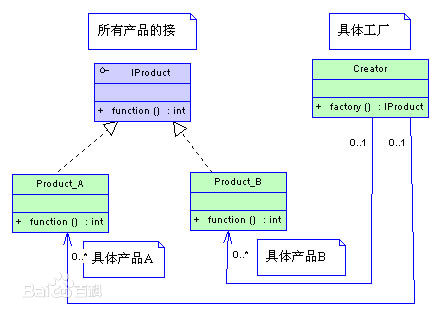
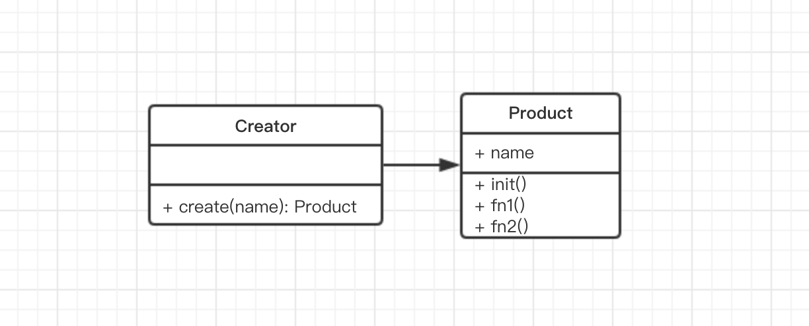

# 1. 工厂模式
工厂模式是我们最常用的实例化对象模式，是用工厂方法代替`new`操作的一种模式。**`new`可以考虑使用工厂模式**，虽然这样做，可能多做一些工作，但会给系统带来更大的可扩展性和尽量少的修改量。

设计原则验证：构造函数和创建者分离，符合**开放封闭原则**

# 2. 演示

常见的工厂模式的 UML 类图如下：



不过前端 JS 使用时，左侧的 Product 没有那么复杂。没有接口，也很少有多种子类，因此 UML 类图可简化为：




此处说明，**之前讲过前端学习设计模式不能按照 java 的方式来，UML 类图也一样**。设计模式要学以致用，因此得考虑 JS 语法和使用场景。


代码演示：

```js
class Product {
    constructor(name) {
        this.name = name
    }
    init() {
        alert('init')
    }
    fun1() {
        alert('fn1')
    }
    fun2() {
        alert（'fn2'）
    }
}

class Creator {
    create(name) {
        return new Product(name)
    }
}

// 测试
let creator = new Creator()
let p = creator.create('p1')
p.init()
p.fn1()
```


但是在日常工作编码中，不会再额外增加`Creator`的类了，`create`直接当做静态的函数就行了。


# 3. 场景

工厂模式在日常使用非常多，凡是用到`new`的地方，都要考虑是否需要工厂模式。

## 3.1 jQuery `$('div')`

模拟代码，`$`就是一个工厂

```js
class jQuery {
    constructor(selector) {
        let slice = Array.prototype.slice
        let dom = slice.call(document.querySelectorAll(selector))
        let len = dom ? dom.length : 0
        for (let i = 0; i < len; i++) {
            this[i] = dom[i]
        }
        this.length = len
        this.selector = selector || ''
    }
    append(node) {

    }
    addClass(name) {

    }
    html(data) {

    }
    // 此处省略若干 API
}
window.$ = function (selector) {
    return new jQuery(selector)
}
```

做一个对比，如果开放给用户的不是`$`，然后让用户自己去`new jQuery(selector)`，带来的问题：

- 操作复杂，代码量增加，如`$('div').append($('#p1')).html()`这种操作将变得冗长繁琐
- 一旦构造函数`jQuery`有变化，使用者都受牵连，不符合开闭原则

## 3.2 `React.createElement`

其实`React.createElement`也是一个工厂，模拟代码

```js
class Vnode(tag, attrs, chilren) {
    // ...省略内部代码...
}
React.createElement =  function (tag, attrs, children) {
    return new Vnode(tag, attrs, chilren)
}
```

## 3.3 vue 异步组件

文档 https://cn.vuejs.org/v2/guide/components-dynamic-async.html

为了简化，Vue 允许你以一个工厂函数的方式定义你的组件，这个工厂函数会异步解析你的组件定义。Vue 只有在这个组件需要被渲染的时候才会被触发，且会把结果缓存起来供未来重渲染。例如：

```js
Vue.component('async-example', function (resolve, reject) {
  setTimeout(function () {
    resolve({
      template: '<div>I am async!</div>'
    })
  }, 1000)
})
```

Vue 组件实例也算 new 出来的
