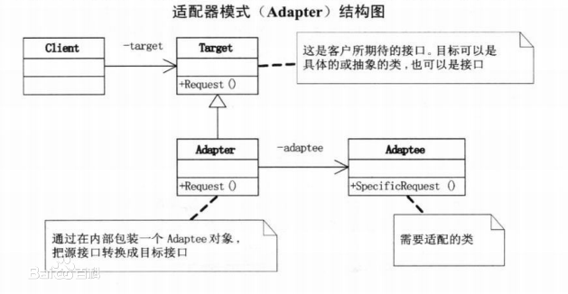

# 1. 适配器模式

将一个类的接口适配成用户所期待的。一个适配允许通常因为接口不兼容而不能在一起工作的类工作在一起，做法是将类自己的接口包裹在一个已存在的类中。


关键点：重新封装一个接口

设计原则验证：将现有接口和使用者进行分离，符合**开放封闭原则**

# 2. 演示

常见的 UML 类图是



因为 JS 少有类继承，也没有强类型，因此可简化为


代码是：

```js
class Adaptee {
    specificRequest() {
        return '德国标准的插头'
    }
}

class Target {
    constructor() {
        this.adaptee = new Adaptee()
    }
    request() {
        let info = this.adaptee.specificRequest()
        return `${info} -> 转换器 -> 中国标准的插头`
    }
}

// 测试
let target = new Target()
target.request()
```

# 3. 场景


# 3.1 ajax 封装

```js
// 自己封装的 ajax ，使用方式如下：
ajax({
    url:'/getData',
    type:'Post',
    dataType:'json',
    data:{
        id:"123"
    }
})
.done(function(){})

// 但因为历史原因，代码中全都是：
// $.ajax({...})
```
```js
// 做一层适配器
var $ = {
    ajax:function (options){
        return ajax(options);
    }
}
```
## 3.2 vue 的 computed

# 4. http-server