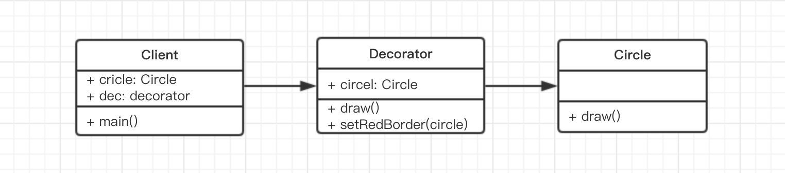

# 1. 装饰器模式

动态地给一个对象添加一些额外的职责。
设计原则验证：将现有对象和装饰器进行分离，两者独立存在，符合**开放封闭原则**

# 2. 演示




代码演示

```js
class Circle {
    draw() {
        console.log('画一个原型')
    }
}

class Decorator {
    constructor(circle) {
        this.circle = circle
    }
    draw() {
        this.circle.draw()
        this.setRedBoder(circle)
    }
    setRedBoder(circle) {
        console.log('设置红色边框')
    }
}

// 测试代码
let circle = new Circle()
circle.draw()

let dec = new Decorator(circle)  // 装饰
dec.draw()
```

# 3. 场景 ES7

另外注意，**装饰器是在编译时执行的而不是运行时**。

## 3.1 ES7 装饰器

参考 http://es6.ruanyifeng.com/#docs/decorator

## 3.2 装饰类

### 3.2.1 demo

```js
// 一个简单的 demo
@testDec
class Demo {
  // ...
}

function testDec(target) {
  target.isDec = true;
}
alert(Demo.isDec) // true
```

### 3.2.2 加参数

```js
// 可以加参数
function testDec(isDec) {
  return function(target) {
    target.isDec = isDec;
  }
}

@testDec(true)
class Demo {
    // ...
}
alert(Demo.isDec) // true
```

### 3.2.3 原理

```js
// 装饰器的原理

@decorator
class A {}

// 等同于

class A {}
A = decorator(A) || A;
```

最后一个示例

```js
function mixins(...list) {
  return function (target) {
    Object.assign(target.prototype, ...list)
  }
}

const Foo = {
  foo() { alert('foo') }
}

@mixins(Foo)
class MyClass {}

let obj = new MyClass();
obj.foo() // 'foo'
```

## 3.3 装饰方法

### 3.3.1 demo

```js
function readonly(target, name, descriptor){
  // descriptor 属性描述对象（Object.defineProperty 中会用到），原来的值如下
  // {
  //   value: specifiedFunction,
  //   enumerable: false,
  //   configurable: true,
  //   writable: true
  // };
  descriptor.writable = false;
  return descriptor;
}

class Person {
    constructor() {
        this.first = 'A'
        this.last = 'B'
    }

    // 装饰方法
    @readonly
    name() { return `${this.first} ${this.last}` }
}

var p = new Person()
console.log(p.name())
// p.name = function () {} // 这里会报错，因为 name 是只读属性
```

### 3.3.2 自动打印日志

```js
function log(target, name, descriptor) {
  var oldValue = descriptor.value;

  descriptor.value = function() {
    console.log(`Calling ${name} with`, arguments);
    return oldValue.apply(this, arguments);
  };

  return descriptor;
}

class Math {
  // 装饰方法
  @log
  add(a, b) {
    return a + b;
  }
}

const math = new Math();
const result = math.add(2, 4);  // 执行 add 时，会自动打印日志，因为有 @log 装饰器
console.log('result', result);
```

# 4. 场景 core-decorators

[core-decorators.js](https://github.com/jayphelps/core-decorators) 是一个第三方模块，提供了几个常见的修饰器，通过它可以更好地理解修饰器。

`npm i core-decorators --save`

## 4.1 readonly demo
```js
// 首先安装 npm i core-decorators --save

// 开始编码：
import { readonly } from 'core-decorators'

class Person {
    @readonly
    name() {
        return 'zhang'
    }
}

let p = new Person()
alert(p.name())
// p.name = function () { /*...*/ }  // 此处会报错
```

## 4.2 对已经弃用的协议给出警告

```js
import { deprecate } from 'core-decorators';

class Person {
  @deprecate
  facepalm() {}

  @deprecate('We stopped facepalming')
  facepalmHard() {}

  @deprecate('We stopped facepalming', { url: 'http://knowyourmeme.com/memes/facepalm' })
  facepalmHarder() {}
}

let person = new Person();

person.facepalm();
// DEPRECATION Person#facepalm: This function will be removed in future versions.

person.facepalmHard();
// DEPRECATION Person#facepalmHard: We stopped facepalming

person.facepalmHarder();
// DEPRECATION Person#facepalmHarder: We stopped facepalming
//
//     See http://knowyourmeme.com/memes/facepalm for more details.
```
